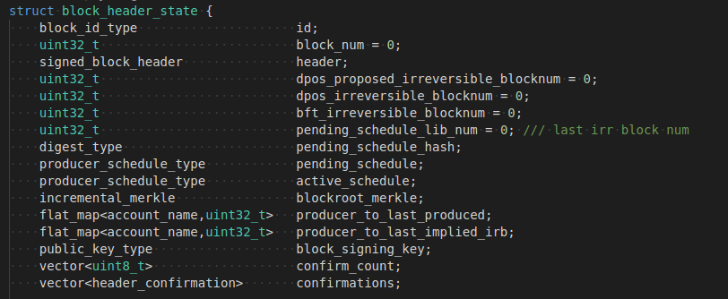
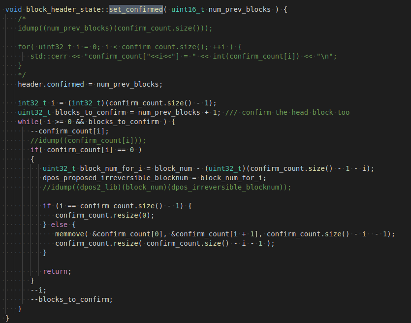

# Interface Description
Different consensuses may require custom data structures at the head of the block, and new consensus needs to redefine this part of data.

Under the mechanism of DPOS, the requirements for confirming a block in different algorithms are different. Only when the requirements of the consensus algorithm are met, the block can be agreed and enter an irreversible state. Dimension integrates this part. Each node uses different acknowledgment algorithms for the block according to different consensus when it produce a block and receives a block for confirmation. The corresponding function is implemented in set_confirmed().

